# Merging satellite-based precipitation datasets with ground observations using RFmerge (\>=0.3-0)

## About

This vignette updates an earlier tutorial developed for `RFmerge`
version 0.1-6 and previous releases, which relied on the now-superseded
`raster` package.

The current workflow uses the `terra` package and demonstrates how
`RFmerge` can be used to create an improved gridded precipitation
product by combining satellite-based precipitation estimates with in
situ observations and physically meaningful covariates, including
elevation and distances to rain gauge stations.

We use the Valparaiso Region in central Chile as a case study. The
example shows how to generate a daily merged precipitation product at
$`0.05^\circ`$ spatial resolution for January-August 1983. The workflow
requires the following inputs:

1.  daily rainfall time series from rain gauges,

2.  metadata describing the spatial coordinates and identifiers of the
    rain gauges,

3.  the Climate Hazards Group InfraRed Precipitation with Station data
    version 2.0 (CHIRPSv2),

4.  the Precipitation Estimation from Remotely Sensed Information using
    Artificial Neural Networks - Climate Data Record (PERSIANN-CDR), and

5.  the Shuttle Radar Topography Mission version 4 (SRTM-v4) digital
    elevation model (DEM).

In addition, distances from rain gauges to grid cells can be used as
covariates. When requested, these distances are computed internally by
`RFmerge` from each rain gauge station to every grid cell within the
study area.

## Citation

If you find this tutorial useful, please cite it as Zambrano-Bigiarini
et al. (2026):

> Zambrano-Bigiarini, M.; Baez-Villanueva, O.M.; Giraldo-Osorio, J.D.
> (2026). Merging satellite-based precipitation datasets with ground
> observations using RFmerge (\>=0.3-0). <doi:10.5281/zenodo.20061103>.

The theoretical basis of the merging algorithm is described in the
following *Remote Sensing of Environment* article:

> Baez-Villanueva, O. M.; Zambrano-Bigiarini, M.; Beck, H.; McNamara,
> I.; Ribbe, L.; Nauditt, A.; Birkel, C.; Verbist, K.; Giraldo-Osorio,
> J.D.; Thinh, N.X. (2020). [RF-MEP: a novel Random Forest method for
> merging gridded precipitation products and ground-based
> measurements](https://doi.org/10.1016/j.rse.2019.111606), Remote
> Sensing of Environment, 239, 111610. <doi:10.1016/j.rse.2019.111606>.

Please also cite the `RFmerge` R package:

> Zambrano-Bigiarini, M.; Baez-Villanueva, O.M., Giraldo-Osorio, J.
> (2026). RFmerge: Merging of Satellite Datasets with Ground
> Observations using Random Forests. R package version 0.3-3. URL:
> <https://hzambran.github.io/RFmerge/>.
> <doi:10.32614/CRAN.package.RFmerge>.

## Required `RFmerge` version

This tutorial was developed for `RFmerge >= 0.3-0`, the first release
series in which `RFmerge` is based on the
[terra](https://cran.r-project.org/package=terra) package.

All previous `RFmerge` versions up to 0.1-6 were based on the superseded
[raster](https://cran.r-project.org/package=raster) package. `RFmerge`
0.1-6 was removed from CRAN on 2023-02-25 because issues related to
retired spatial dependencies, such as `rgdal`, could not be resolved in
time.

## Installation

Install the latest stable version (from CRAN):

``` r

install.packages("RFmerge")
```

Alternatively, you can try the development version from
[GitHub](https://github.com/hzambran/RFmerge):

``` r

if (!require(devtools)) install.packages("devtools")
library(devtools)
install_github("hzambran/RFmerge")
```

## Setting up the R environment

1.  Load the supporting packages used in this analysis:

``` r

library(zoo)
library(terra)
```

2.  Load `RFmerge`, which provides the merging function and the example
    datasets:

``` r

library(RFmerge)
```

## Loading input data

The example uses daily rainfall observations from 34 rain gauges located
in Valparaiso for the period *1983-01-01* to *1983-08-31*. These
observations are available in the **ValparaisoPPts** dataset included
with `RFmerge`. In an applied study, an equivalent dataset would
typically be read from a CSV file, database export, or `zoo` object.

The **ValparaisoPPgis** dataset contains the identifiers and spatial
coordinates of the rain gauges. The **ValparaisoSHP** object represents
the polygon used to define the outer boundary of the study area; in a
user application, this information would commonly be read from a
shapefile, GeoPackage, or another vector format supported by `terra`.

``` r

data(ValparaisoPPts)    
data(ValparaisoPPgis) 
```

``` r

ValparaisoSHP.fname <- system.file("extdata/ValparaisoSHP.shp",package="RFmerge")
ValparaisoSHP       <- terra::vect(ValparaisoSHP.fname)
```

Next, we load the satellite-based precipitation datasets and the static
terrain covariate. In this example, CHIRPSv2 (Funk et al., 2015) and
PERSIANN-CDR (Ashouri et al., 2015), both at $`0.05^\circ`$ spatial
resolution, are used as dynamic covariates; here, *dynamic* means that
the covariate varies through time. The SRTM-v4 DEM, also at
$`0.05^\circ`$ spatial resolution, is used as a static covariate to
represent the influence of elevation on precipitation; here, *static*
means that the covariate does not vary through time.

``` r

chirps.fname   <- system.file("extdata/CHIRPS5km.tif"       ,package="RFmerge")
prsnncdr.fname <- system.file("extdata/PERSIANNcdr5km.tif"  ,package="RFmerge")
dem.fname      <- system.file("extdata/ValparaisoDEM5km.tif",package="RFmerge")

CHIRPS5km        <- terra::rast(chirps.fname)
PERSIANNcdr5km   <- terra::rast(prsnncdr.fname)
ValparaisoDEM5km <- terra::rast(dem.fname)   
```

## Basic exploratory data analysis

The two multi-band GeoTIFF files provided in the `RFmerge` package do
not store the date of each precipitation estimate as the name of the
corresponding layer. Before the exploratory analysis, we therefore
assign meaningful layer names to `CHIRPS5km` and `PERSIANNcdr5km`:

``` r

#ldates                <- hydroTSM::dip("1983-01-01", "1983-08-31")
ldates                <- seq(from=as.Date("1983-01-01"), to=as.Date("1983-08-31"), by="days")
names(CHIRPS5km)      <- ldates
names(PERSIANNcdr5km) <- ldates  
```

We can then inspect the first six rows of the station metadata:

``` r

head(ValparaisoPPgis)
```

    ##       Code      lon      lat            NOM_REG  NOM_PROV COD_COM     NOM_COM
    ## 1 P5101005 -70.8000 -32.0836 Regin de Valparaso Los Andes    5304 San Esteban
    ## 2 P5111002 -71.0300 -32.1567 Regin de Valparaso Los Andes    5304 San Esteban
    ## 3 P5101006 -70.7833 -32.1836 Regin de Valparaso Los Andes    5304 San Esteban
    ## 4 P5100006 -70.7839 -32.2261 Regin de Valparaso Los Andes    5304 San Esteban
    ## 5 P5100005 -70.7100 -32.2286 Regin de Valparaso Los Andes    5304 San Esteban
    ## 6 P5111001 -71.1386 -32.2528 Regin de Valparaso Los Andes    5304 San Esteban

The following plot shows the daily precipitation time series for the
first rain gauge station (code: *P5101005*).

``` r

main <- paste("Daily precipitation for the station", ValparaisoPPgis$Code[1])
ylab <- "Precipitation [mm]"
x.ts <- ValparaisoPPts[,1]

#hydroTSM::hydroplot(x.ts, pfreq="o", main=main, ylab= ylab)
plot(x.ts, main=main, ylab= ylab, col="blue")
grid()
```

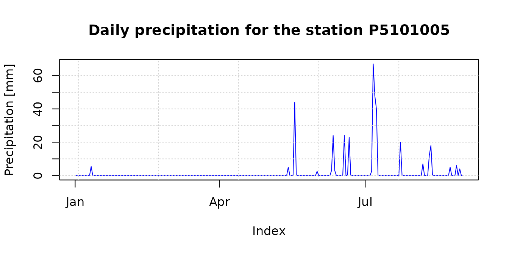

The accumulated precipitation fields for January-August 1983 provide a
first visual comparison between CHIRPSv2 and PERSIANN-CDR. The
study-area boundary is overlaid to place the gridded estimates in their
spatial context:

``` r

chirps.total   <- sum(CHIRPS5km, na.rm= FALSE)
persiann.total <- sum(PERSIANNcdr5km, na.rm= FALSE)


plot(chirps.total, main = "CHIRPSv2 [Jan - Aug] ", 
     xlab = "Longitude", ylab = "Latitude",
     fun=function() lines(ValparaisoSHP))
```

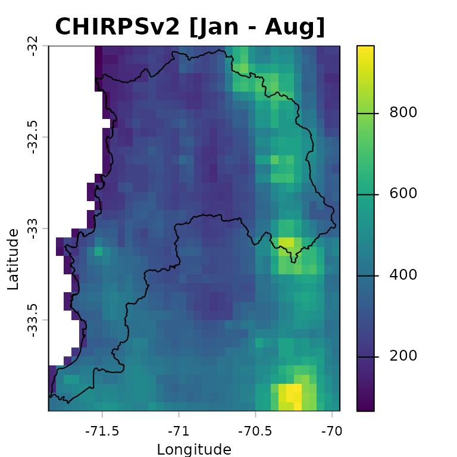

``` r

plot(persiann.total, main = "PERSIANN-CDR [Jan - Aug]", 
     xlab = "Longitude", ylab = "Latitude",
     fun=function() lines(ValparaisoSHP))
```

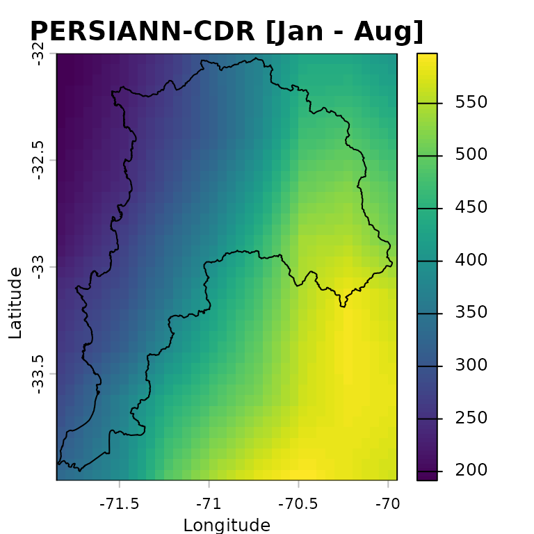

## Preparing input data

### Spatial metadata

To work with the rain gauge locations as spatial data, we convert the
station metadata stored in `ValparaisoPPgis` into a `SpatVector`. The
coordinates are read from the `lon` and `lat` columns of the
`ValparaisoPPgis` data frame:

``` r

ValparaisoPPgis.vec <- terra::vect(ValparaisoPPgis, geom=c("lon", "lat"), crs="epsg:4326")
```

We can now plot the DEM together with the rain gauge locations and the
study-area boundary. This map is useful for checking whether the station
network samples the main elevation gradients across the region:

``` r

plot(ValparaisoDEM5km, main="SRTM-v4", xlab="Longitude", ylab="Latitude", 
     col=terrain.colors(255),
     fun=function() {lines(ValparaisoSHP) ; 
                     points(ValparaisoPPgis.vec, pch=16, col="black") 
                    }
    )
```

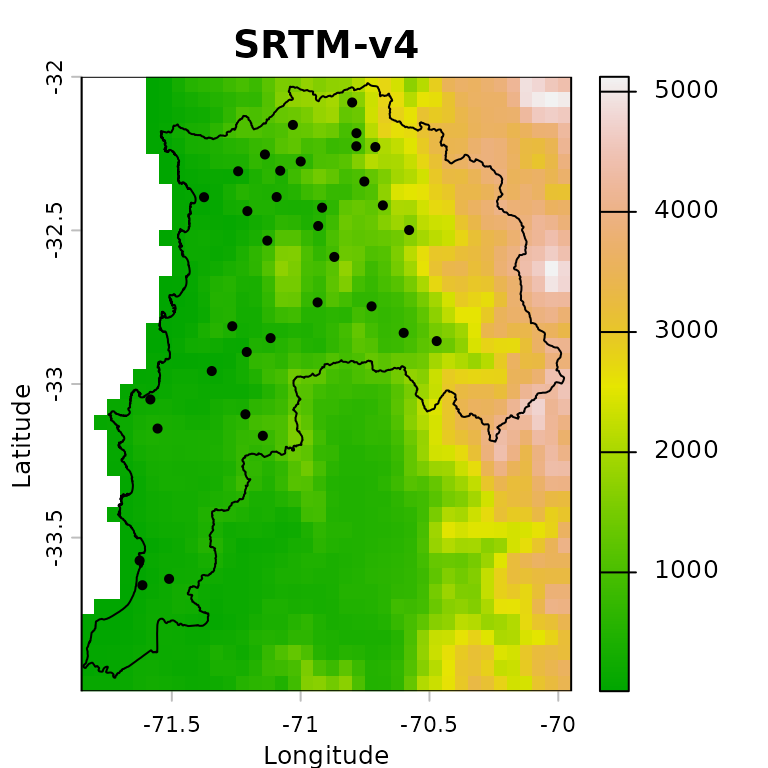

### Verification of covariates

This example produces a merged precipitation product for the period from
1983-01-01 to 1983-08-31, i.e., 243 days. The satellite precipitation
products used as covariates must therefore have 243 layers each, one for
each day in the analysis period. This number must match the **number of
rows** in `ValparaisoPPts`.

``` r

terra::nlyr(CHIRPS5km)
```

    ## [1] 243

``` r

( terra::nlyr(CHIRPS5km) == terra::nlyr(PERSIANNcdr5km) )
```

    ## [1] TRUE

``` r

( terra::nlyr(CHIRPS5km) == nrow(ValparaisoPPts) )
```

    ## [1] TRUE

We also verify that the precipitation products and the DEM share the
same extent, number of rows and columns, coordinate reference system,
resolution, and origin:

``` r

terra::compareGeom(CHIRPS5km, PERSIANNcdr5km, ValparaisoDEM5km)
```

    ## [1] TRUE

#### Optional: reprojection into another CRS

When distances are used as covariates in `RFmerge` (argument `ED=TRUE`),
it is natural to ask whether the input layers should first be
reprojected from longitude/latitude into a projected coordinate
reference system. `RFmerge` relies on distance calculations provided by
`terra`, whose `distance` documentation states:

> *The distance is always expressed in meter if the coordinate reference
> system is longitude/latitude, and in map units otherwise. Map units
> are typically meter, but inspect crs(x) if in doubt*.

> *Results are more precise, sometimes much more precise, when using
> longitude/latitude rather than a planar coordinate reference system,
> as these distort distance*.

Therefore, in contrast to the recommendation used in earlier `RFmerge`
versions based on the `raster` package, **we will not reproject the main
input datasets before running the geographical-coordinate example**.

## Running `RFmerge` using geographical coordinates

### Covariates

To run `RFmerge`, we first create the covariate object expected by the
function. The covariates are supplied as a list:

``` r

covariates<- list(chirps=CHIRPS5km, persianncdr=PERSIANNcdr5km, 
                  dem=ValparaisoDEM5km)
```

> The **order and names of the covariates in the list are not
> important**.

### Setup

The next decision is how many in situ observations will be used to train
the random forest model and how many will be held out for independent
evaluation.

In this example, 80% of the rain gauge stations are used for training
and the remaining 20% are reserved for evaluation:

``` r

geoNoPar.drty.out <- file.path(tempdir(), "RFmergeResults_geographical_noparallel")
system.time(rfmep.NoPar.geo <- RFmerge(x=ValparaisoPPts, 
                                      cov=covariates,
                                      metadata=ValparaisoPPgis, 
                                      id="Code", lat="lat", lon="lon", 
                                      mask=ValparaisoSHP, 
                                      training=0.8, 
                                      seed=1000,
                                      write2disk=TRUE, 
                                      drty.out=geoNoPar.drty.out
                                      ) 
            )
```

    ## [ Creating the training (80%) and evaluation (20%) datasets ... ]

    ## Warning: [vect] guessed crs

    ## [ Computing the Euclidean distances to each observation of the training set ...]

    ##    user  system elapsed 
    ##  22.139   0.299  22.442

The argument `seed=1000` is used to make the random forest training and
the station split reproducible.

If the merged files should be written to disk for further inspection or
reuse, set `write2disk=TRUE` and define the output directory with
`drty.out` before running `RFmerge`.

## Running `RFmerge` using a projected reference system

### Reprojection

To assess the sensitivity of the workflow to the coordinate reference
system, we repeat the analysis after projecting the inputs to WGS 84 /
UTM zone 19S (EPSG:32719):

First, we reproject all gridded covariates:

``` r

utmz19s.p4s <- "epsg:32719" # WGS 84 / UTM zone 19S

CHIRPS5km.utm        <- terra::project(x=CHIRPS5km       , y=utmz19s.p4s)
PERSIANNcdr5km.utm   <- terra::project(x=PERSIANNcdr5km  , y=utmz19s.p4s)
ValparaisoDEM5km.utm <- terra::project(x=ValparaisoDEM5km, y=utmz19s.p4s)
```

Second, we reproject the in situ rain gauge stations:

``` r

ValparaisoPPgis.vec.utm <- terra::project(x=ValparaisoPPgis.vec, y=utmz19s.p4s)
```

Third, we reproject the polygon used to define the study area:

``` r

ValparaisoSHP.utm <- terra::project(ValparaisoSHP, y=utmz19s.p4s)
```

Fourth, we create a new data frame with the metadata expected by
`RFmerge`, i.e., at least the station ID and two coordinate columns. In
this projected example, the column names `lon` and `lat` are retained
for compatibility with the function arguments, although they now contain
easting and northing coordinates:

``` r

id        <- ValparaisoPPgis.vec.utm[["Code"]][,1]
st.coords <- terra::crds(ValparaisoPPgis.vec.utm)
lon       <- st.coords[, "x"]
lat       <- st.coords[, "y"]

ValparaisoPPgis.utm <- data.frame(Code=id, lon=lon, lat=lat)
```

### Covariates

We now create the covariate list to be used by `RFmerge` in the
projected-coordinate example:

``` r

covariates.utm <- list(chirps=CHIRPS5km.utm, persianncdr=PERSIANNcdr5km.utm, 
                       dem=ValparaisoDEM5km.utm)
```

> The **order and names of the covariates in the list are not
> important**.

### Setup

To obtain results comparable with the geographical-coordinate run, we
use the same 80% training and 20% evaluation split, controlled by the
same random seed:

``` r

utmNoPar.drty.out <- file.path(tempdir(), "RFmergeResults_utm_noparallel")
system.time(rfmep.NoPar.utm <- RFmerge(x=ValparaisoPPts, 
                                      cov=covariates.utm,
                                      metadata=ValparaisoPPgis.utm, 
                                      id="Code", lat="lat", lon="lon", 
                                      mask=ValparaisoSHP.utm, 
                                      training=0.8, 
                                      seed=1000,
                                      write2disk=TRUE, 
                                      drty.out=utmNoPar.drty.out
                                     ) 
            )
```

    ## [ Creating the training (80%) and evaluation (20%) datasets ... ]

    ## [ Computing the Euclidean distances to each observation of the training set ...]

    ##    user  system elapsed 
    ##  19.824   0.131  19.957

## Running `RFmerge` using the `parallel` argument

One of the main advantages of moving `RFmerge` from the superseded
`raster` package to `terra` is the substantial improvement in
computational speed.

For larger applications, or when working on a multicore machine or
computing cluster, additional speed gains can be obtained through the
`parallel` argument in `RFmerge`.

First, define the maximum number of cores or nodes to use in the
parallel computations:

``` r

ncores.nmax <- 10 # maximum amount of cores the user wants to use
```

Next, detect whether the operating system is Windows and set the
`parallel` argument accordingly:

``` r

onWin <- ( (R.version$os=="mingw32") | (R.version$os=="mingw64") )
ifelse(onWin, parallel <- "parallelWin", parallel <- "parallel")
```

    ## [1] "parallel"

Then, select a safe number of cores by comparing the user-defined
maximum (`ncores.nmax`) with the number of cores available in the
current environment
([`parallel::detectCores()`](https://rdrr.io/r/parallel/detectCores.html)).
The following code also avoids invalid values when `detectCores()`
returns `NA` or only one available core:

``` r

( ncores.available <- parallel::detectCores() )
```

    ## [1] 4

``` r

if (is.na(ncores.available)) ncores.available <- 2
( par.nnodes <- max(1, min(ncores.available - 1, ncores.nmax) ) )
```

    ## [1] 3

We can now run `RFmerge` with parallel processing, using at most
`ncores.nmax` cores:

``` r

geoPar.drty.out <- file.path(tempdir(), "RFmergeResults_geographical_parallel")
system.time(rfmep.Par.geo <- RFmerge(x=ValparaisoPPts, 
                                    cov=covariates,
                                    metadata=ValparaisoPPgis, 
                                    id="Code", lat="lat", lon="lon", 
                                    mask=ValparaisoSHP, 
                                    training=0.8, 
                                    seed=1000,
                                    write2disk=TRUE,  
                                    drty.out=geoPar.drty.out, 
                                    parallel=parallel, par.nnodes=par.nnodes
                                   )
            )
```

    ## [ Creating the training (80%) and evaluation (20%) datasets ... ]

    ## Warning: [vect] guessed crs

    ## [ Computing the Euclidean distances to each observation of the training set ...]

    ## [ Parallelisation finished ! ]

    ##    user  system elapsed 
    ##  40.785   1.385  18.453

## `RFmerge` outputs

If `RFmerge` runs successfully and `write2disk=TRUE`, the following
outputs are stored in the user-defined `drty.out` directory:

1.  the rain gauge stations used for training and evaluation; and

2.  the final merged product, written as individual *GeoTIFF* files.

These outputs are organized within `drty.out` as follows:

- `Ground_based_data/Training/`: stores the time series and metadata
  used to train RF-MEP as a `zoo` file (`Training_ts.txt`) and a text
  file (`Training_metadata.txt`), respectively.

- `Ground_based_data/Evaluation/`: stores the time series and metadata
  withheld from model training and used for independent evaluation. The
  `Evaluation_ts.txt` and `Evaluation_metadata.txt` files are stored as
  `zoo` and CSV files, respectively.

- `RF-MEP/`: stores the individual *GeoTIFF* files produced by the
  RF-MEP algorithm, using the same spatial resolution as the selected
  covariates.

## Evaluation of `RFmerge` using geographical coordinates

### Reading `RFmerge` outputs

To evaluate the outputs obtained with `RFmerge` in **geographical
coordinates**, we use the rain gauge observations withheld from model
training.

For this purpose, we import the time series and metadata from the
evaluation stations and convert the station metadata into a spatial
object:

``` r

ts.path       <- file.path(geoNoPar.drty.out, "Ground_based_data/Evaluation/Evaluation_ts.txt")
metadata.path <- file.path(geoNoPar.drty.out, "Ground_based_data/Evaluation/Evaluation_metadata.txt")

eval.ts  <- read.zoo(ts.path, header = TRUE)
eval.gis <- read.csv(metadata.path)

# Promote 'eval.gis' to a spatial object so it can be plotted.
( eval.gis.vec <- terra::vect(eval.gis, geom=c("lon", "lat")) )
```

    ## Warning: [vect] guessed crs

    ## class       : SpatVector
    ## geometry    : points
    ## dimensions  : 7, 5  (geometries, attributes)
    ## extent      : -71.5553, -70.7247, -33.145, -32.1567  (xmin, xmax, ymin, ymax)
    ## coord. ref. : +proj=longlat +datum=WGS84 +no_defs
    ## names       :     Code            NOM_REG  NOM_PROV COD_COM     NOM_COM
    ## type        :    <chr>              <chr>     <chr>   <int>       <chr>
    ## values      : P5111002 Regin de Valparaso Los Andes    5304 San Esteban
    ##               P5120003 Regin de Valparaso Los Andes    5304 San Esteban
    ##               P5210002 Regin de Valparaso Los Andes    5304 San Esteban
    ##               ...

### Basic plotting of `RFmerge` outputs for a single day

First, define the colours and precipitation classes used in the
subsequent plots:

``` r

minmax(rfmep.NoPar.geo[[11]])                       # range of values to be plotted
```

    ##     1983-01-11
    ## min    0.34209
    ## max   12.60838

``` r

breaks <- c(0, 2, 4, 6, 8, 10, 12, 15, 20)         # 8 categories for the precipitation values
colors <- RColorBrewer::brewer.pal(n=8, "YlGnBu")  # 8 colours
```

The following plot provides a basic visualisation of RF-MEP
precipitation for one day, 1983-01-11, with the study-area boundary and
evaluation stations overlaid:

``` r

plot(rfmep.NoPar.geo[[11]],
     main="RF-MEP precipitation for 1983-01-11", 
     xlab="Longitude", ylab="Latitude", 
     breaks=breaks, col=colors
     )
lines(ValparaisoSHP, col="black")
points(eval.gis.vec, pch = 18)
```

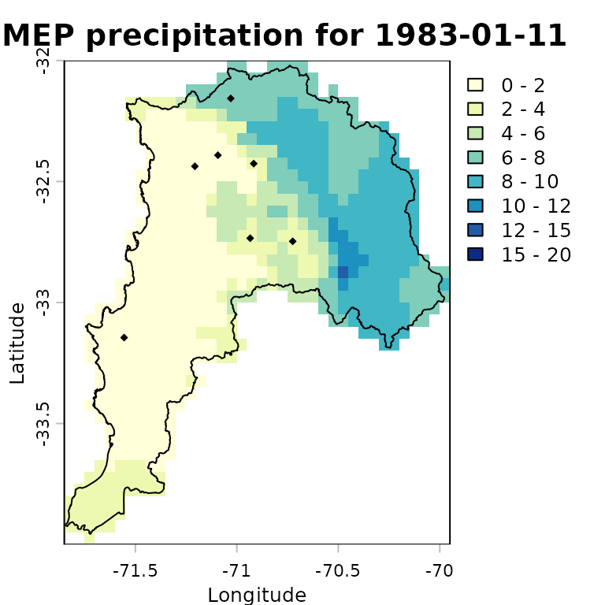

### Advanced plotting of `RFmerge` outputs for a single day

For a more informative comparison, we can plot the evaluation-station
observations using the same precipitation classes and colour palette as
the RF-MEP raster:

``` r

stations.vals   <- as.numeric(eval.ts[11,])
stations.colors <- cut(stations.vals, breaks=breaks, 
                       labels=colors, include.lowest=TRUE)
stations.colors <- as.character(stations.colors) # Convert factors to colour strings
```

We then overlay the study-area boundary and colour the evaluation
stations using the same palette as the merged product. This allows a
quick visual check of how closely the RF-MEP field agrees with
observations that were not used during training.

``` r

plot(rfmep.NoPar.geo[[11]], 
     main="RF-MEP precipitation for 1983-01-11", 
     xlab="Longitude", ylab="Latitude", 
     breaks=breaks, col=colors,
     plg = list(title = "P, [mm]")
     )
lines(ValparaisoSHP, col="black")

# Adding labels from a specific column in the SpatVector
# -) labels: The name of the column in your SpatVector containing the text 
#            you want to display.
# -) halo  : Set to TRUE to add a buffer around the text, making it more 
#            readable against complex raster backgrounds.
# -) pos   : Determines the position relative to the point 
#            (1=below, 2=left, 3=above, 4=right).
points(eval.gis.vec, pch = 23, # Diamond with fill and border
       bg = stations.colors,      # Fill colour
       col = "black",             # Border (outline) colour
       cex=0.9)
text(eval.gis.vec, labels="Code", halo=TRUE, pos=3, cex=0.4, col="black")
text(eval.gis.vec, label=paste(stations.vals, "mm"), 
     halo=TRUE, pos=1, cex=0.4, col="black")
```

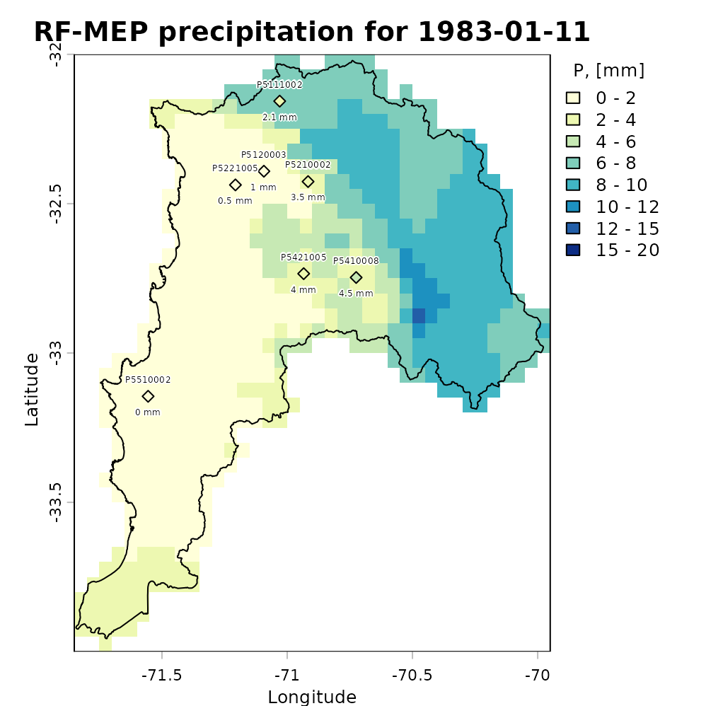

### Plotting the total amount of precipitation

The following map shows accumulated RF-MEP precipitation over Valparaiso
for January-August 1983, with the study-area boundary overlaid:

``` r

rfmep.total <- sum(rfmep.NoPar.geo, na.rm= FALSE)

plot(rfmep.total, main = "RF-MEP [Jan - Aug]", 
     xlab = "Longitude", ylab = "Latitude")
lines(ValparaisoSHP, lwd=1.5)
```

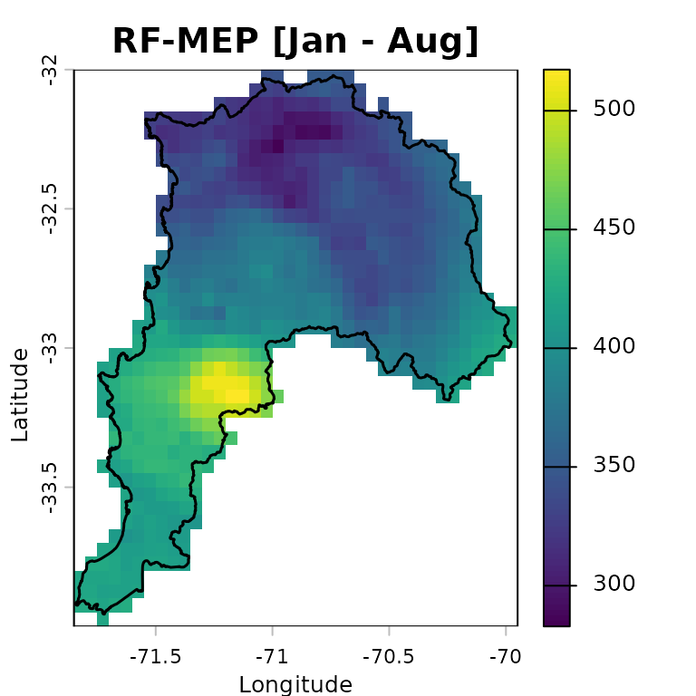

### Numeric assessment of `RFmerge` effectiveness

We evaluate the merged product obtained with `RFmerge` in **geographical
coordinates**, hereafter RF-MEP, together with the two satellite
precipitation products used as covariates. All products are compared
against the in situ rain gauge observations in the evaluation set.

To extract gridded precipitation values at the rain gauge locations, we
use the `extract` function from `terra`:

``` r

eval.gis.vec <- vect(eval.gis, geom = c("lon", "lat"))
```

    ## Warning: [vect] guessed crs

``` r

rfmep.NoPar.geo.ts <- t(terra::extract(rfmep.NoPar.geo, eval.gis.vec))
chirps.ts         <- t(terra::extract(CHIRPS5km     , eval.gis.vec))
persiann.ts       <- t(terra::extract(PERSIANNcdr5km, eval.gis.vec))
```

The output of
[`terra::extract`](https://rspatial.github.io/terra/reference/extract.html)
includes an ID column for the extracted points. After transposition,
this becomes the first row, which must be removed before comparing the
extracted precipitation time series with the observed gauge records:

``` r

rfmep.NoPar.geo.ts <- rfmep.NoPar.geo.ts[-1, ]
chirps.ts         <- chirps.ts[-1, ]
persiann.ts       <- persiann.ts[-1, ]
```

To evaluate the performance of RF-MEP and the two satellite products in
geographical coordinates, we use the Nash-Sutcliffe efficiency (NSE), as
implemented in the [hydroGOF](https://mzb.cl/hydroGOF/) R package. NSE
ranges from negative infinity to one, with an optimal value of 1.

``` r

sres       <- list(chirps.ts, persiann.ts, rfmep.NoPar.geo.ts)
nsres      <- length(sres)
nstations  <- ncol(eval.ts)
tmp        <- rep(NA, nstations)
nse.table.NoPar.geo <- data.frame(ID=eval.gis[["Code"]], 
                                 CHIRPS=tmp, 
                                 PERSIANN_CDR=tmp, 
                                 RF_MEP=tmp)

# Compute NSE between observed rainfall at the evaluation gauges and each
# gridded product: CHIRPSv2, PERSIANN-CDR, and RF-MEP.
for (i in 1:nsres) {
  ldates <- time(eval.ts)
  lsim   <- zoo(sres[[i]], ldates)
  nse.table.NoPar.geo[, (i+1)] <- round( hydroGOF::NSE(sim= lsim, obs= eval.ts, 
                                                     na.rm=TRUE), 3 )
} # FOR end

# Show the final performance table for all products.
nse.table.NoPar.geo
```

    ##         ID CHIRPS PERSIANN_CDR RF_MEP
    ## 1 P5111002  0.055        0.279  0.842
    ## 2 P5120003 -0.101        0.333  0.951
    ## 3 P5210002  0.166        0.378  0.934
    ## 4 P5221005 -0.451        0.089  0.853
    ## 5 P5421005 -1.516        0.255  0.637
    ## 6 P5410008 -0.167        0.373  0.863
    ## 7 P5510002  0.054        0.173  0.791

### Graphical assessment of `RFmerge` effectiveness

Finally, we create a boxplot comparing the *NSE* performance of the
merged product with the original satellite rainfall estimates used as
covariates:

``` r

# Boxplot for graphical comparison.
sres.cols <- c("powderblue", "palegoldenrod", "mediumseagreen")
boxplot(nse.table.NoPar.geo[,2:4], 
        main = "Daily NSE evaluation for Jan - Aug 1983 \n using geographical coordinates",
        xlab = "Precipitation products", ylab = "NSE", ylim = c(-0.5, 1),
        col=sres.cols)
legend("topleft", legend=c("CHIRPS", "PERSIANN-CDR", "RF-MEP"), 
       col=sres.cols, pch=15, cex=1.5, bty="n")
grid()
```

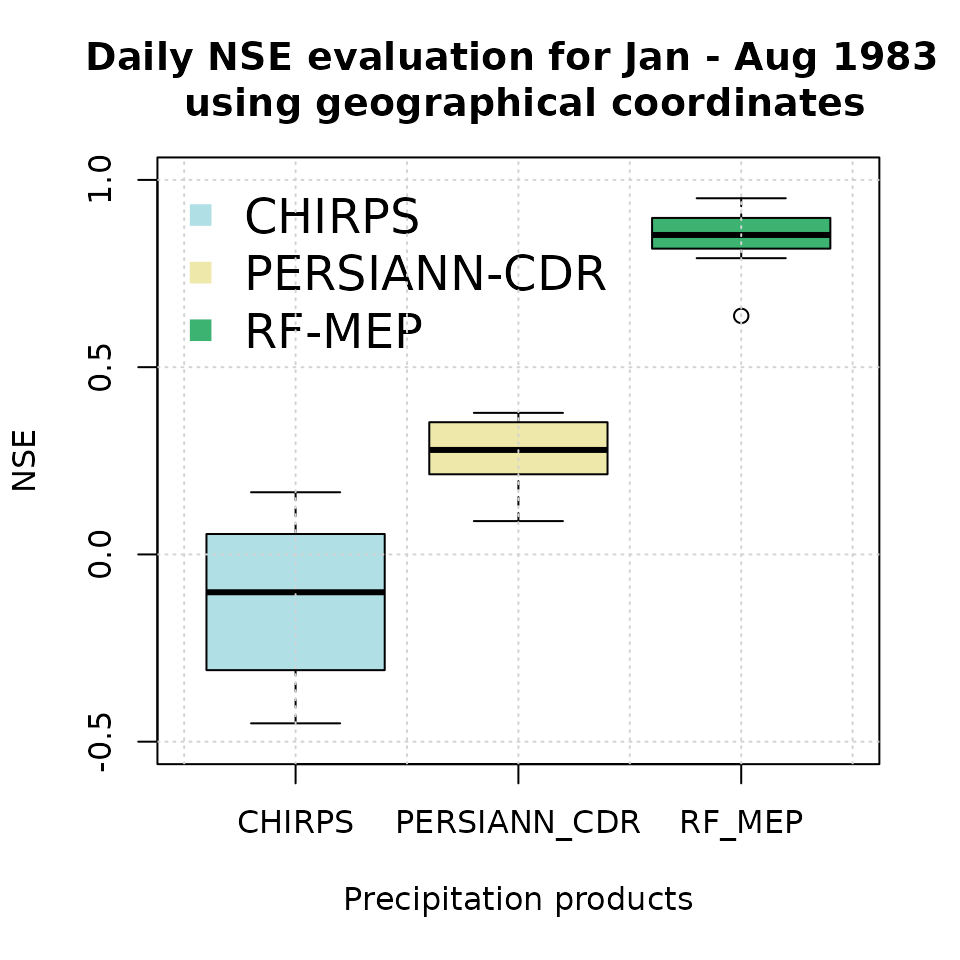

Higher NSE values indicate stronger agreement with the withheld rain
gauge observations. In applications with sparse or uneven station
networks, this summary should be interpreted together with spatial
diagnostics, because a high aggregate score can still hide local errors
in complex terrain or coastal transition zones.

## Evaluation of `RFmerge` using projected coordinates

### Reading `RFmerge` outputs

To evaluate the outputs obtained with `RFmerge` in **projected (UTM)
coordinates**, we again use the rain gauge observations withheld from
model training.

We import the evaluation time series and metadata, then convert the
station metadata into a projected spatial object:

``` r

ts.path       <- file.path(utmNoPar.drty.out, "Ground_based_data/Evaluation/Evaluation_ts.txt")
metadata.path <- file.path(utmNoPar.drty.out, "Ground_based_data/Evaluation/Evaluation_metadata.txt")

eval.ts      <- read.zoo(ts.path, header = TRUE)
eval.gis.utm <- read.csv(metadata.path)

# Promote 'eval.gis.utm' to a spatial object so it can be plotted.
( eval.gis.vec.utm <- terra::vect(eval.gis.utm, geom=c("lon", "lat"), crs=utmz19s.p4s ) )
```

    ## class       : SpatVector
    ## geometry    : points
    ## dimensions  : 7, 1  (geometries, attributes)
    ## extent      : 261653.7, 338417.6, 6329731, 6440390  (xmin, xmax, ymin, ymax)
    ## coord. ref. : WGS 84 / UTM zone 19S (EPSG:32719)
    ## names       :     Code
    ## type        :    <chr>
    ## values      : P5111002
    ##               P5120003
    ##               P5210002
    ##               ...

### Basic plotting of `RFmerge` outputs for a single day

First, define the colours and precipitation classes used in the
subsequent plots:

``` r

minmax(rfmep.NoPar.utm[[11]])                       # range of values to be plotted
```

    ##     1983-01-11
    ## min  0.4933442
    ## max 12.8569300

``` r

breaks <- c(0, 2, 4, 6, 8, 10, 12, 15, 20)         # 8 categories for the precipitation values
colors <- RColorBrewer::brewer.pal(n=8, "YlGnBu")  # 8 colours
```

The following plot provides a basic visualisation of RF-MEP
precipitation for one day, 1983-01-11, with the projected study-area
boundary and evaluation stations overlaid:

``` r

plot(rfmep.NoPar.utm[[11]],
     main="RF-MEP precipitation for 1983-01-11", 
     xlab="Easting", ylab="Northing", 
     breaks=breaks, col=colors
     )
lines(ValparaisoSHP.utm, col="black")
points(eval.gis.vec.utm, pch = 18)
```

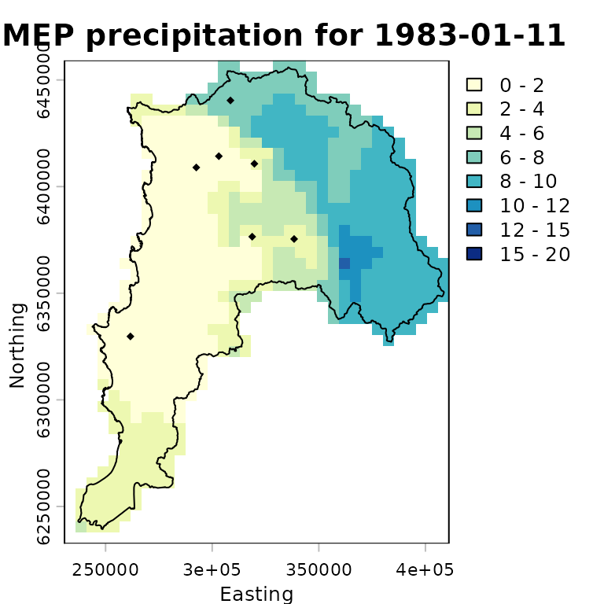

### Advanced plotting of `RFmerge` outputs for a single day

For a more informative comparison, we plot the evaluation-station
observations using the same precipitation classes and colour palette as
the RF-MEP raster:

``` r

stations.vals   <- as.numeric(eval.ts[11,])
stations.colors <- cut(stations.vals, breaks=breaks, 
                       labels=colors, include.lowest=TRUE)
stations.colors <- as.character(stations.colors) # Convert factors to colour strings
```

We then overlay the study-area boundary and colour the evaluation
stations using the same palette as the merged product. This allows a
quick visual check of how closely the projected-coordinate RF-MEP field
agrees with observations that were not used during training.

``` r

plot(rfmep.NoPar.utm[[11]], 
     main="RF-MEP precipitation for 1983-01-11", 
     xlab="Easting", ylab="Northing", 
     breaks=breaks, col=colors,
     plg = list(title = "P, [mm]")
     )
lines(ValparaisoSHP.utm, col="black")

# Adding labels from a specific column in the SpatVector
# -) labels: The name of the column in your SpatVector containing the text 
#            you want to display.
# -) halo  : Set to TRUE to add a buffer around the text, making it more 
#            readable against complex raster backgrounds.
# -) pos   : Determines the position relative to the point 
#            (1=below, 2=left, 3=above, 4=right).
points(eval.gis.vec.utm, pch = 23, # Diamond with fill and border
       bg = stations.colors,      # Fill colour
       col = "black",             # Border (outline) colour
       cex=0.9)
text(eval.gis.vec.utm, labels="Code", halo=TRUE, pos=3, cex=0.4, col="black")
text(eval.gis.vec.utm, label=paste(stations.vals, "mm"), 
     halo=TRUE, pos=1, cex=0.4, col="black")
```

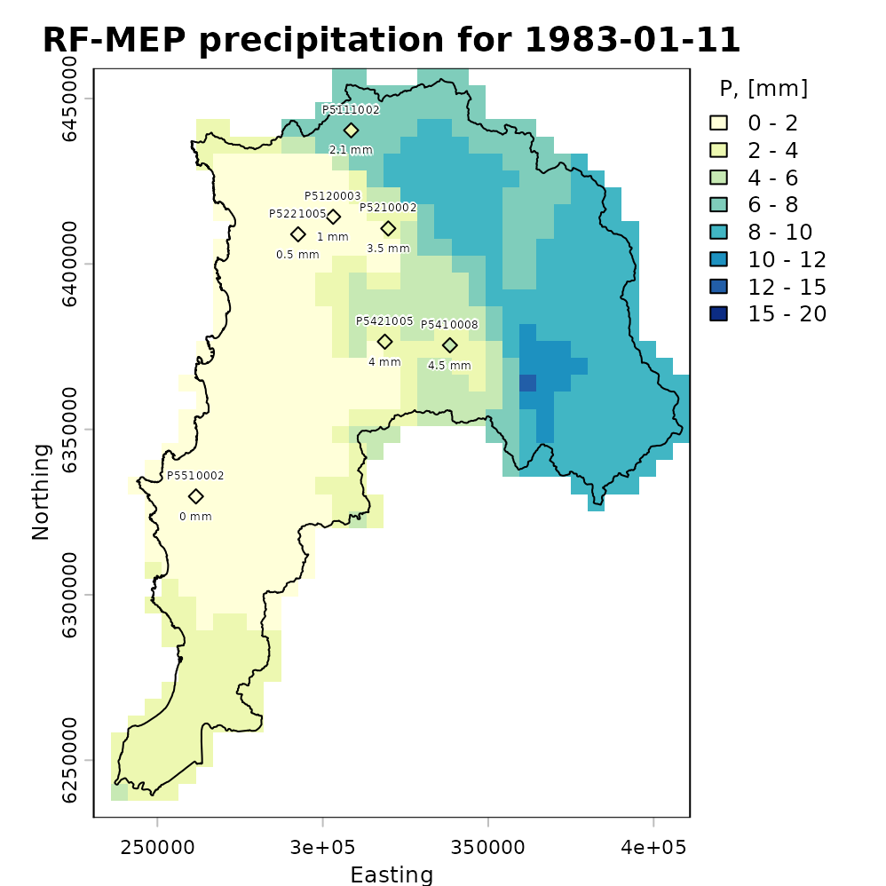

### Plotting the total amount of precipitation

The following map shows accumulated RF-MEP precipitation over Valparaiso
for January-August 1983 in the projected-coordinate run, with the
study-area boundary overlaid:

``` r

rfmep.total.utm <- sum(rfmep.NoPar.utm, na.rm= FALSE)

plot(rfmep.total.utm, main = "RF-MEP [Jan - Aug]", 
     xlab = "Easting", ylab = "Northing")
lines(ValparaisoSHP.utm, lwd=1.5)
```

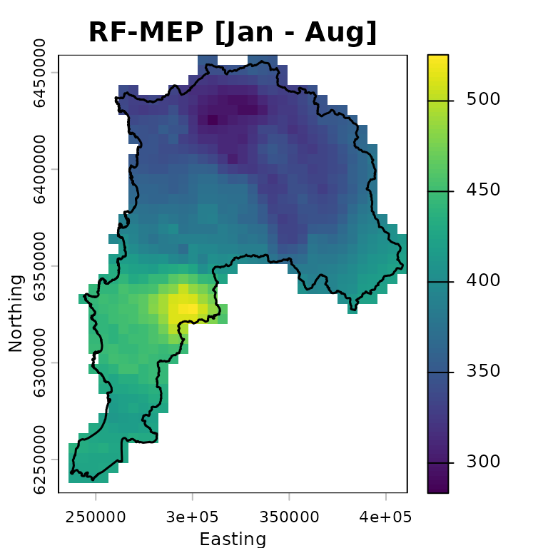

### Numeric assessment of `RFmerge` effectiveness

We evaluate the merged product obtained with `RFmerge` in **projected
coordinates**, hereafter RF-MEP, together with the two satellite
precipitation products used as covariates. All products are compared
against the in situ rain gauge observations in the evaluation set.

To extract gridded precipitation values at the rain gauge locations, we
use the `extract` function from `terra`:

``` r

rfmep.NoPar.utm.ts <- t(terra::extract(rfmep.NoPar.utm   , eval.gis.vec.utm))
chirps.ts.utm      <- t(terra::extract(CHIRPS5km.utm     , eval.gis.vec.utm))
persiann.ts.utm    <- t(terra::extract(PERSIANNcdr5km.utm, eval.gis.vec.utm))
```

The output of
[`terra::extract`](https://rspatial.github.io/terra/reference/extract.html)
includes an ID column for the extracted points. After transposition,
this becomes the first row, which must be removed before comparing the
extracted precipitation time series with the observed gauge records:

``` r

rfmep.NoPar.utm.ts <- rfmep.NoPar.utm.ts[-1, ]
chirps.ts.utm     <- chirps.ts.utm[-1, ]
persiann.ts.utm   <- persiann.ts.utm[-1, ]
```

To evaluate the performance of RF-MEP and the two satellite products in
projected coordinates, we use the Nash-Sutcliffe efficiency (NSE), as
implemented in the [hydroGOF](https://mzb.cl/hydroGOF/) R package. NSE
ranges from negative infinity to one, with an optimal value of 1.

``` r

sres       <- list(chirps.ts.utm, persiann.ts.utm, rfmep.NoPar.utm.ts)
nsres      <- length(sres)
nstations  <- ncol(eval.ts)
tmp        <- rep(NA, nstations)
nse.table.NoPar.utm <- data.frame(ID=eval.gis.utm[["Code"]], 
                                 CHIRPS=tmp, 
                                 PERSIANN_CDR=tmp, 
                                 RF_MEP=tmp)

# Compute NSE between observed rainfall at the evaluation gauges and each
# gridded product: CHIRPSv2, PERSIANN-CDR, and RF-MEP.
for (i in 1:nsres) {
  ldates <- time(eval.ts)
  lsim   <- zoo(sres[[i]], ldates)
  nse.table.NoPar.utm[, (i+1)] <- round( hydroGOF::NSE(sim= lsim, obs= eval.ts, 
                                                     na.rm=TRUE), 3 )
} # FOR end

# Show the final performance table for all products.
nse.table.NoPar.utm
```

    ##         ID CHIRPS PERSIANN_CDR RF_MEP
    ## 1 P5111002  0.009        0.283  0.832
    ## 2 P5120003 -0.052        0.338  0.950
    ## 3 P5210002  0.178        0.384  0.932
    ## 4 P5221005 -0.549        0.091  0.860
    ## 5 P5421005 -0.386        0.248  0.615
    ## 6 P5410008  0.129        0.370  0.838
    ## 7 P5510002  0.041        0.182  0.788

### Graphical assessment of `RFmerge` effectiveness

Finally, we create a boxplot comparing the *NSE* performance of the
merged product with the original satellite rainfall estimates used as
covariates:

``` r

# Boxplot for graphical comparison.
sres.cols <- c("powderblue", "palegoldenrod", "mediumseagreen")
boxplot(nse.table.NoPar.utm[,2:4], 
        main = "Daily NSE evaluation for Jan - Aug 1983 \n using projected coordinates",
        xlab = "Precipitation products", ylab = "NSE", ylim = c(-0.5, 1),
        col=sres.cols)
legend("topleft", legend=c("CHIRPS", "PERSIANN-CDR", "RF-MEP"), 
       col=sres.cols, pch=15, cex=1.5, bty="n")
grid()
```

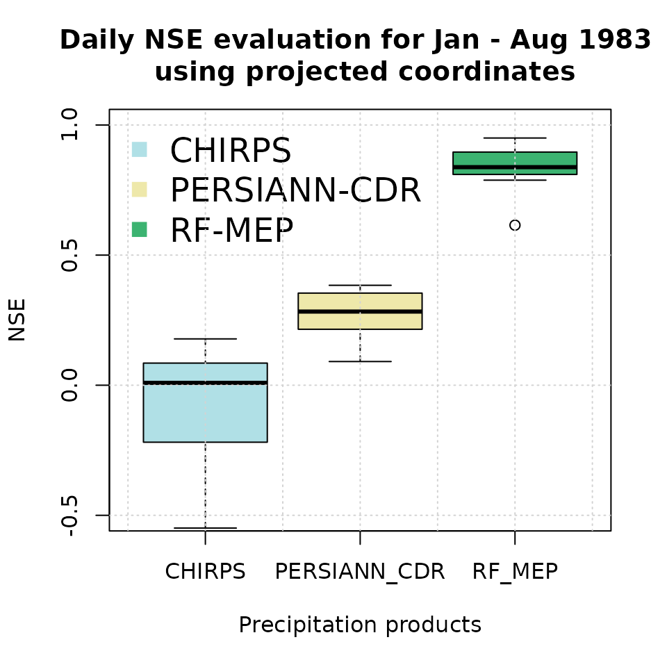

This second evaluation is useful for checking whether reprojection
materially changes the merged product or the extracted values at station
locations. In practice, the geographical-coordinate workflow is usually
preferable for distance calculations in `terra`, but a
projected-coordinate comparison can be helpful when a project requires
consistency with existing GIS layers or regional modelling workflows.

## Software details

This tutorial was built under:

    ## [1] "x86_64-pc-linux-gnu"

    ## [1] "R version 4.6.0 (2026-04-24)"

    ## [1] "RFmerge 0.3-4"

    ## [1] "terra 1.9-25"

    ## [1] "hydroGOF 0.7-0"

    ## [1] "RColorBrewer 1.1-3"

## Version history

-) v0.3.1: 07-May-2026

-) v0.3 : 06-May-2026

-) v0.2 : 12-May-2023 (not publicly released)

-) v0.1 : 07-Jan-2020

## References

1.  Ashouri, H., Hsu, K.-L., Sorooshian, S., Braithwaite, D. K.,
    Knapp, K. R., Cecil, L. D., Nelson, B. R., and Prat, O. P. (2015).
    PERSIANN-CDR: Daily Precipitation Climate Data Record from
    Multisatellite Observations for Hydrological and Climate Studies,
    Bulletin of the American Meteorological Society, 96, 69–83,
    <doi:10.1175/BAMS-D-13-00068.1>.

2.  Baez-Villanueva, O. M.; Zambrano-Bigiarini, M.; Beck, H.; McNamara,
    I.; Ribbe, L.; Nauditt, A.; Birkel, C.; Verbist, K.; Giraldo-Osorio,
    J.D.; Thinh, N.X. (2020). RF-MEP: a novel Random Forest method for
    merging gridded precipitation products and ground-based
    measurements, Remote Sensing of Environment, 239, 111610.
    <doi:10.1016/j.rse.2019.111606>.
    <https://doi.org/10.1016/j.rse.2019.111606>.

3.  Funk, C., Peterson, P., Landsfeld, M., Pedreros, D., Verdin, J.,
    Shukla, S., Husak, G., Rowland, J., Harrison, L., Hoell, A., and
    Michaelsen, J. (2015) The climate hazards infrared precipitation
    with stations-a new environmental record for monitoring extremes,
    Sci Data, 2, 150 066, <doi:10.1038/sdata.2015.66>.

4.  Hengl, T., Nussbaum, M., Wright, M. N., Heuvelink, G. B., &
    Gr"{a}ler, B. (2018). Random forest as a generic framework for
    predictive modeling of spatial and spatio-temporal variables. PeerJ,
    6, e5518. <doi:10.7717/peerj.5518>.
    <https://doi.org/10.7717/peerj.5518>.
